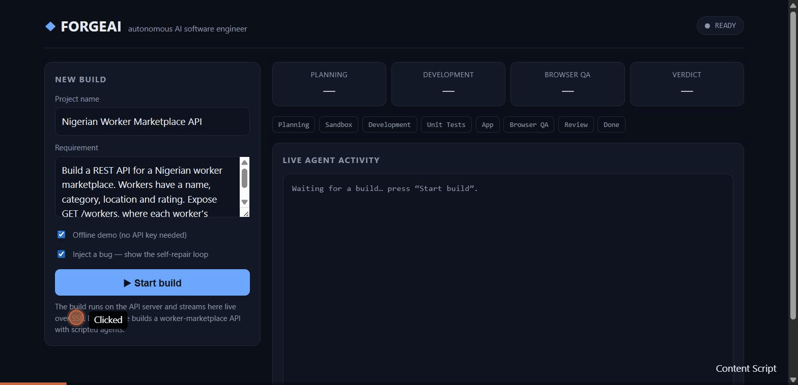

# ForgeAI

> **An autonomous AI software engineer that plans, builds, tests, repairs, and verifies software inside isolated Solari environments.**

ForgeAI is a portfolio/hiring-challenge project designed to demonstrate practical AI-agent engineering with Solari.

## Demo



*The self-repair loop, live: with "Inject a bug" enabled, the Developer's first attempt fails its unit test → the Debugger diagnoses the root cause → the Developer applies the fix → the test passes → ForgeAI emits a PASS engineering report. Recorded from the running dashboard.*

## Status

**Phase 1 (Proof of Concept) — ✅ working.** The hardest technical path is proven end-to-end:
`infra provider → sandbox → generate a Node API → run it → preview URL → browser QA → verify behavior → cleanup`,
with every result backed by observed evidence (HTTP status, response body, exit codes).

## Quick start

```bash
npm install
npm run build          # compile the @forgeai/* packages
npm run poc            # Phase 1: end-to-end sandbox → API → browser QA proof
                       #   (uses port 3000; override: FORGEAI_POC_PORT=3400 npm run poc)
npm run ai:smoke       # AI layer proof (mock provider, no API key needed)
npm run dev:smoke      # Developer Agent proof: build + test in a sandbox
npm run arch:smoke     # Architect → Developer handoff: plan → build → test
npm run qa:smoke       # QA Agent proof: browser checks with honest verdicts
npm run journey:smoke  # Browser JOURNEYS: nav+assert PASS, interactive step
                       #   honestly INCONCLUSIVE on the local http-only browser
npm run dbg:smoke      # Autonomous repair: plant a bug → diagnose → fix → verify
npm run rev:smoke      # Reviewer: evidence-gated verdict + engineering report
npm run demo           # FULL PIPELINE: requirement → tested app + report
npm run demo:repair    # SAME, but a bug is injected → autonomous repair loop
npm run demo:web       # BEHAVIORAL bug: real web app renders a wrong rating,
                       #   browser QA catches it → autonomous repair → re-verify
npm run api            # HTTP API + live SSE event stream (see below)
npm run web            # Dashboard UI (Next.js) — run alongside `npm run api`
```

### Dashboard

`npm run api` (backend, port 4000) + `npm run web` (dashboard, port 3000) gives a
live UI: enter a requirement, press **Start build**, and watch the pipeline
stream — phase cards, a lighting-up timeline, a colour-coded agent log, and the
final engineering report with verdict, test/QA counts, bugs and a preview link.
The dashboard talks to the backend only over HTTP/SSE (`NEXT_PUBLIC_API_BASE`,
default `http://localhost:4000`) and holds no credentials.

Tick **"Inject a bug — show the self-repair loop"** to watch the closed
engineering loop live: the Developer's first attempt ships a real bug, the unit
test fails, the Debugger diagnoses it, the Developer fixes it, and the test
passes — all autonomously, streamed to the log with a "self-repairing…"
indicator and an "autonomous fix" marker on the timeline.

### HTTP API + live event stream (SSE)

`npm run api` starts the ForgeAI backend on `http://localhost:4000`. It runs the
whole pipeline server-side (credentials never reach the browser) and streams
every agent event live over Server-Sent Events — the same stream that will drive
the dashboard.

```bash
# start a build (offline demo — no API key needed)
curl -sX POST localhost:4000/api/projects -H 'content-type: application/json' \
  -d '{"demo":true,"name":"My build"}'
# -> { "id": "…", "events": "/api/projects/<id>/events" }

curl -N localhost:4000/api/projects/<id>/events   # watch it build, live
curl -s  localhost:4000/api/projects/<id>          # status + final report
```

| Method & path | Purpose |
|---|---|
| `POST /api/projects` | Start a build `{ requirement, name?, demo? }` |
| `GET /api/projects` | List builds |
| `GET /api/projects/:id` | Build detail + final engineering report |
| `GET /api/projects/:id/events` | Live event stream (SSE; replays history on connect) |

Set `FORGEAI_AI_PROVIDER` (+ its key) to run real agents; otherwise the API
falls back to the offline scripted demo so the stream still works with no key.

**`npm run demo` is the whole product in one run:** one requirement in →
Architect plans → sandbox → Developer builds → unit tests → app starts →
browser QA → Reviewer → engineering report out. The Orchestrator drives all
five agents through `PLANNING → … → COMPLETED`, looping back to `DEBUGGING`
(the autonomous repair loop) whenever tests or QA fail, with bounded retries
and automatic resource cleanup. It runs offline via a mock, or against real
Claude/OpenAI/Gemini + Solari by swapping the provider — no other code changes.

### Choosing an AI provider

ForgeAI's agents talk to one `AIProvider` interface, so the model vendor is a
config switch — **Claude, OpenAI, and Gemini are all supported**, plus a keyless
`mock` for offline runs. Set `FORGEAI_AI_PROVIDER` to `anthropic` | `openai` |
`gemini` | `mock` and provide the matching API key in `.env`.

By default the PoC runs in **local mock mode** (no Solari key needed) so the full
loop is runnable anywhere. To run against **real Solari** cloud infrastructure,
copy `.env.example` to `.env`, set `SOLARI_API_KEY`, and either export it or set
`FORGEAI_MODE=solari`. The same agent/tool code runs unchanged in both modes —
that is the point of the `@forgeai/solari` abstraction layer (see `docs/architecture.md` §9).

Expected PoC output ends with:

```text
  RESULT: ✅ PASS — full loop verified with evidence
```


The core promise is simple:

```text
Natural-language requirement
        ↓
AI planning
        ↓
Isolated development environment
        ↓
AI implementation
        ↓
Automated tests
        ↓
Failure analysis
        ↓
Automatic repair
        ↓
Running application
        ↓
Real browser QA
        ↓
Final verification
        ↓
Engineering report
```

## 1. Project Goal

ForgeAI is not intended to be another chatbot or code-completion interface.

It is an **agentic software-engineering loop**.

The system should be able to take a reasonable software requirement, create a disposable development environment, implement the requirement, execute the resulting software, verify behavior, diagnose failures, and repair them.

The project uses Solari for:

- cloud browsers
- isolated code sandboxes
- optional desktop environments in later versions

The MVP focuses on **Sandbox + Browser**.

---

## 2. Why This Project Exists

The Pinetree Research SWE internship challenge asks candidates to fork the Solari Cookbook, build a real use case, publish it publicly, and demonstrate that they can ship. AI-assisted development is explicitly encouraged.

ForgeAI is designed around that challenge.

The project should demonstrate:

- product thinking
- software architecture
- AI-agent design
- safe code execution
- browser automation
- automated testing
- debugging
- observability
- resource management
- shipping

The strongest evidence is not the amount of code generated.

The strongest evidence is:

> **ForgeAI can produce a working result and prove that it works.**

---

## 3. Core Product

### User input

Example:

> Build a REST API for a Nigerian worker marketplace. Customers can create jobs, workers can accept jobs, and customers can rate completed jobs.

### ForgeAI output

```text
Planning complete
Sandbox created
Project initialized
Application implemented
Tests generated
Tests executed
Failures repaired
Application started
Browser QA completed
Final verification passed
Preview available
```

---

## 4. MVP Scope

The first release supports a constrained but meaningful target:

### Supported application type

Node.js REST APIs.

### Recommended stack for generated projects

- Node.js
- TypeScript
- Express
- PostgreSQL or SQLite for local/demo persistence
- Jest/Vitest/Supertest or equivalent testing tools

### ForgeAI itself

- Next.js + TypeScript frontend
- Node.js + TypeScript backend
- PostgreSQL
- Solari Browser SDK
- Solari Sandbox SDK
- SSE for live events

---

## 5. Solari Usage

ForgeAI uses two primary Solari products.

### Sandbox

The sandbox is the AI developer's isolated workspace.

Used for:

- creating files
- editing files
- installing dependencies
- running commands
- running tests
- running development servers
- Git operations
- collecting logs
- exposing preview ports

### Browser

The browser is the AI QA engineer.

Used for:

- opening the generated application
- navigating pages
- filling forms
- clicking controls
- reading content
- taking screenshots
- recording test sessions
- verifying behavior

### Desktop

Desktop support is intentionally postponed until after the MVP.

---

## 6. Product Architecture

```text
                        USER
                          |
                          v
                 +----------------+
                 |  ForgeAI Web   |
                 +-------+--------+
                         |
                         v
                 +----------------+
                 |   ForgeAI API  |
                 +-------+--------+
                         |
                         v
                 +----------------+
                 |  Orchestrator  |
                 +-------+--------+
                         |
          +--------------+---------------+
          |              |               |
          v              v               v
      Architect       Developer          QA
          |              |               |
          |              v               |
          |          Solari Sandbox      |
          |              |               |
          |              +-------+-------+
          |                      |
          |                      v
          |                Running App
          |                      |
          +----------------------+ 
                                 |
                                 v
                           Solari Browser
                                 |
                                 v
                              Results
                                 |
                                 v
                             Debugger
```

---

## 7. Agent Model

ForgeAI uses specialized agents instead of one giant prompt.

### Architect

Turns requirements into a technical plan.

### Developer

Writes and modifies code inside the sandbox.

### QA

Uses the browser to verify real application behavior.

### Debugger

Uses evidence to identify and repair failures.

### Reviewer

Determines whether the project satisfies the requirements.

### Orchestrator

Controls lifecycle, state transitions, limits, retries, and cleanup.

See `AGENTS.md`.

---

## 8. Evidence-First Principle

ForgeAI must never treat an LLM's statement as proof.

Bad:

```text
AI: "The application works."
```

Good:

```text
Unit tests: 31/31 passed
Browser tests: 18/18 passed
Preview health check: 200 OK
```

The system should prefer:

> **Observed evidence over generated claims.**

---

## 9. Security Model

Generated code is untrusted.

Never execute AI-generated code directly on the ForgeAI backend.

Correct:

```text
AI
 ↓
Solari Sandbox
 ↓
Generated code
```

Incorrect:

```text
AI
 ↓
ForgeAI Node.js server
 ↓
child_process.exec(...)
```

The backend is an orchestrator, not the execution environment.

See `SECURITY.md`.

---

## 10. Repository Structure

```text
forgeai/
├── apps/
│   ├── web/
│   └── api/
│
├── packages/
│   ├── ai/
│   ├── agents/
│   │   ├── architect/
│   │   ├── developer/
│   │   ├── qa/
│   │   ├── debugger/
│   │   └── reviewer/
│   ├── solari/
│   ├── database/
│   └── shared/
│
├── examples/
│   └── worker-marketplace/
│
├── tests/
├── docs/
│
├── README.md
├── ARCHITECTURE.md
├── AGENTS.md
├── SECURITY.md
├── DATABASE.md
├── ROADMAP.md
└── .env.example
```

---

## 11. First Demonstration

The primary demonstration project is a Nigerian worker marketplace API.

Entities:

```text
Customer
Worker
Job
Rating
Category
```

Example workflow:

```text
Create customer
      ↓
Create worker
      ↓
Create job
      ↓
Assign worker
      ↓
Complete job
      ↓
Submit rating
      ↓
Verify worker rating
```

Example rating:

```text
5 + 4 + 5 + 3
---------------- = 4.25
       4
```

ForgeAI should generate and test this business logic.

---

## 12. Development Principles

### Keep the MVP small

Do not add infrastructure simply because it sounds impressive.

Avoid initially:

- Kubernetes
- Kafka
- Redis
- Terraform
- Lambda
- microservices
- vector databases
- multi-region deployment
- desktop automation
- complex authentication

Add a technology only when the problem requires it.

### Prefer simple architecture

The MVP should be understandable by a reviewer in minutes.

### Make failures visible

A failed build is more useful than a fake success.

### Make the agent bounded

Every autonomous loop needs:

- timeout
- retry limit
- resource limit
- cancellation
- cleanup

---

## 13. Demo Target

The ideal demo is 60–90 seconds.

Recommended sequence:

1. Enter requirement.
2. ForgeAI creates a sandbox.
3. Architect produces a plan.
4. Developer creates the project.
5. Tests fail.
6. Debugger fixes the failure.
7. Tests pass.
8. Application launches.
9. Browser QA starts.
10. Browser discovers a bug.
11. Debugger repairs it.
12. Browser retests.
13. Final report appears.
14. Preview opens.

The reviewer should see the system **doing the work**, not merely describing it.

---

## 14. Definition of Done

The MVP is complete when ForgeAI can:

- [ ] Accept a software requirement.
- [ ] Generate a plan.
- [ ] Create a Solari sandbox.
- [ ] Initialize a project.
- [ ] Create and modify files.
- [ ] Install dependencies.
- [ ] Generate code.
- [ ] Generate tests.
- [ ] Execute tests.
- [ ] Detect failures.
- [ ] Diagnose failures.
- [ ] Repair code.
- [ ] Re-run tests.
- [ ] Start the application.
- [ ] Obtain a preview URL.
- [ ] Create a Solari browser.
- [ ] Run browser tests.
- [ ] Capture evidence.
- [ ] Detect browser failures.
- [ ] Repair browser failures.
- [ ] Re-test.
- [ ] Produce a final report.
- [ ] Clean up Solari resources.
- [ ] Stream activity to the UI.

---

## 15. Official Solari References

Use the official documentation as the source of truth for SDK/API details.

- Solari documentation: https://docs.getsolari.com/
- Quickstart: https://docs.getsolari.com/quickstart
- SDKs and languages: https://docs.getsolari.com/languages
- Pricing: https://docs.getsolari.com/pricing
- MCP: https://docs.getsolari.com/mcp
- Solari Cookbook: https://github.com/solari-sdk/solari-cookbook

The Solari Cookbook currently demonstrates browser, sandbox, and desktop examples, including browser recording, sandbox file/command operations, port previews, and desktop computer use.
